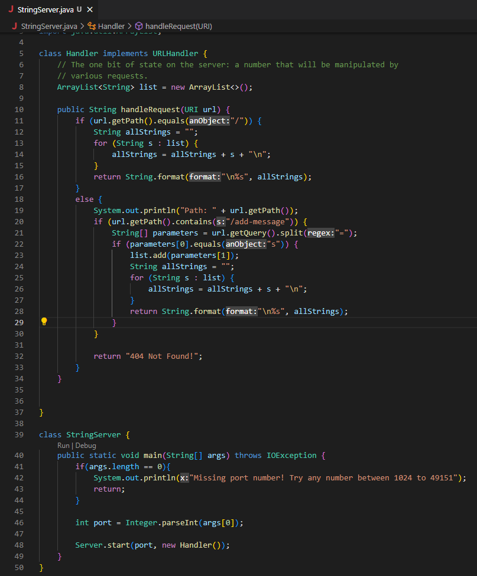
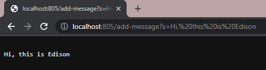
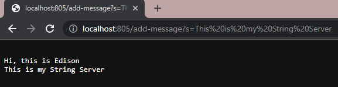
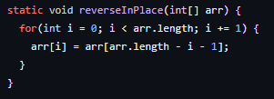
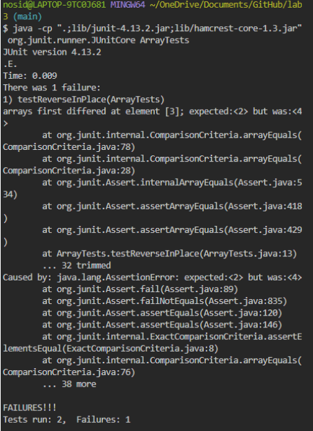
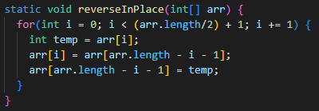

# Lab Report 2

## Part 1

Code for StringServer:

First `/add-message?s=<String>` to the server:

In this `/add-message?s=<String>`, the method "handleRequest" is called. The argument relevant to our method is 
"localhost:805/add-message?s=Hi,%20this%20is%20Edison", which is my URL. The fields that are relevant in the 
method would be `ArrayList<String> list` and `String allStrings`. `list` is used to store all the given strings
by the user, and `allStrings` is a string that contains all the strings currently stored in `list`, which is used 
to be presented to the user to show all the currernt strings on the website. From this specific request, `list` is updated 
from having no strings stored to then store the string "Hi, this is Edison.". Then `allStrings` is updated to become
"Hi, this is Edison.".

Second `/add-message?s=<String>` to the server: 

In this `/add-message?s=<String>`, the method "handleRequest" is called. The argument relevant to our method is 
"localhost:805/add-message?s=This%20is%20my%20String%20Server", which is my URL. The fields that are relevant in the 
method would be `ArrayList<String> list` and `String allStrings`. `list` is used to store all the given strings
by the user, and `allStrings` is a string that contains all the strings currently stored in `list`, which is used 
to be presented to the user to show all the currernt strings on the website. From this specific request, `list` is updated 
from having one string ("Hi, this is Edison.") to having two string, where the second string is "This is my String Server".
Then `allStrings` is updated to become "Hi, this is Edison. /n This is my String Server".

## Part 2

Code with Bug:

Failure (`input2`) and Non-Failure (`input1`) Inputs:

	public void testReverseInPlace() {
		int[] input1 = { 3 };
    	ArrayExamples.reverseInPlace(input1);
    	assertArrayEquals(new int[]{ 3 }, input1);

    	int[] input2 = { 1, 2, 3, 4, 5 };
    	ArrayExamples.reverseInPlace(input2);
    	assertArrayEquals(new int[]{ 5, 4, 3, 2, 1 }, input2);
	}
	
Symptoms:

Bug Free Code:

The reason why the code before the changes would not run properly would be that in the For-loop, only `arr[i]` was being updated, 
but thbe element corresponding to `arr[i]` on the opposite end of the array was not. For example, in an array that consists of the
elements 1, 2, 3, 4, 5 in the given order, element at index 0 would be updated to 5, but element at index 4 would not be updated.

By reducing the lenth of the For-loop to only run through half of a given array and introducing a field `int temp` into the For-loop,
this allows the program to first store the element at index i in `temp`, then change the value at `arr[i]` to the value at 
`arr[arr.length - i - 1]`, then finally changing the value at `arr[arr.length - i - 1]` to `temp`-- which allows for the element to 
continue reversing itself until the For-loop reaches the middle.
