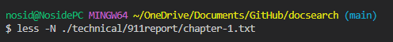
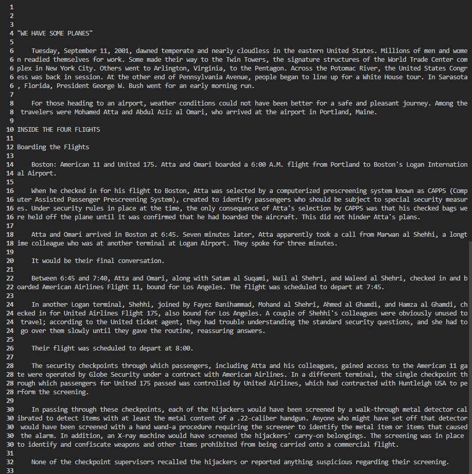
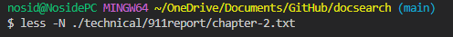
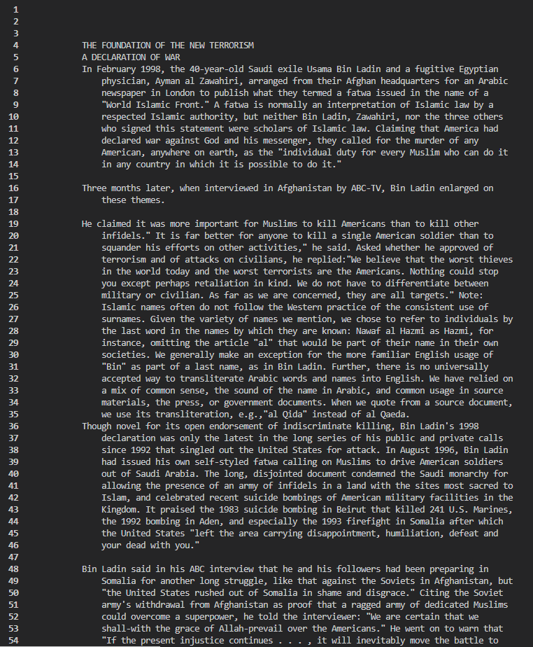

## Lab Report 3

## `less -N <file name>` Command

The `less -N <file name>` command allows for the user to view the file from the terminal with the addition of the line numbers displayed on the right.
This allows for the user to reference certain lines more easily and remember specific lines of important contents of the file.
[Source](https://phoenixnap.com/kb/less-command-in-linux)

Examples:

## `less -X <file name>` Command

blah

