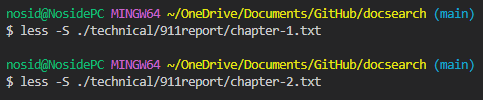

## Lab Report 3

## `less -N <file name>` Command

The `less -N <file name>` command allows for the user to view the file from the terminal with the addition of the line numbers displayed on the right.
This allows for the user to reference certain lines more easily and remember specific lines of important contents of the file.

[Source](https://phoenixnap.com/kb/less-command-in-linux)

Examples:

## `less -S <file name>` Command

The `less -S <file name>` command makes it so that when the file is displayed, the lines do not wrap. This means that every line is separated and displayed in only one line.
This is useful for displaying lines in a neater and more easier way of reading the contents of the file.

[Source](https://unix.stackexchange.com/questions/31/list-of-useful-less-functions)

Examples:

## `less -X <file name>` Command

The `less -X <file name>` command allows for the user to keep the displayed contents of the file up on the terminal even after quitting `less`.
This would be useful for users to look directly back at the contents of the file while using the terminal at the same time without having to re-open the file through `less`.

[Source](https://phoenixnap.com/kb/less-command-in-linux)

Examples:

## `less -p '<keyword>' <file name>` Command

The `less -p '<keyword>' <file name>` command allows for the user to highlight every `<keyword>` in the file, if it exists within the file. This allows the user
to easily locate data that may be hard to find in a large file.

[Source](https://phoenixnap.com/kb/less-command-in-linux)

Examples:

