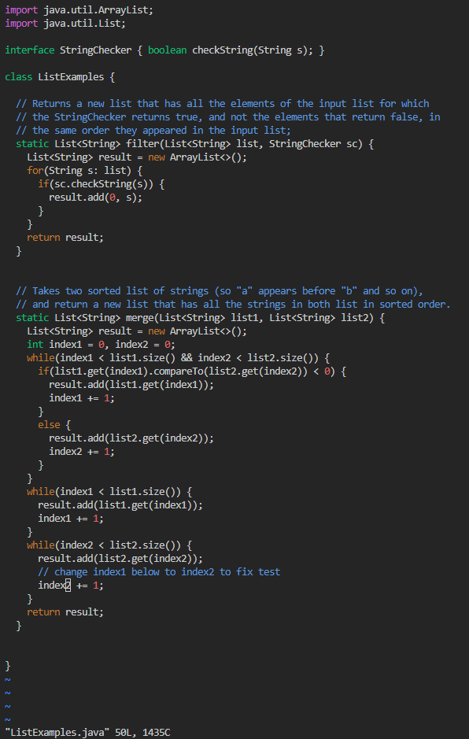
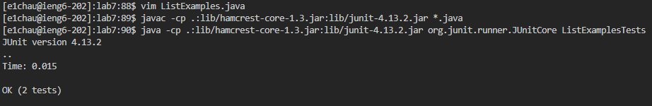
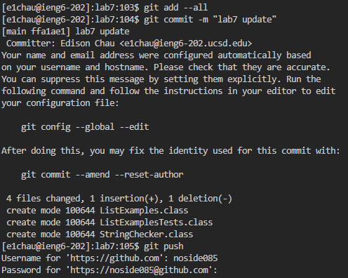

# Lab Report 4

## Logging in, Cloning

Keys Pressed: `ssh e1chau@ieng6.ucsd.edu`, `<enter>`, `<my password>`, `<enter>`, `git clone https://github.com/noside085/lab7`, `<enter>`

Summary: The `ssh e1chau@ieng6.ucsd.edu` command and entering my password allowed me to log into my `ieng6` account. Then the `git clone https://github.com/noside085/lab7` allowed me to clone my repository for lab7 from my github account to the server.

## Running (Failed) Test

Keys Pressed: `ls`, `<enter>`, `cd lab7`, `<enter>`, `javac -cp .:lib/hamcrest-core-1.3.jar:lib/junit-4.13.2.jar *.java`, `<enter>`, `java -cp .:lib/hamcrest-core-1.3.jar:lib/junit-4.13.2.jar org.junit.runner.JUnitCore ListExamplesTests`, `<enter>`

Summary: The command `ls` allowed me to view the content in my current directory, then `cd lab7` changed the directory to `lab7`. Afterwards, I used the commands `javac -cp .:lib/hamcrest-core-1.3.jar:lib/junit-4.13.2.jar *.java` and `java -cp .:lib/hamcrest-core-1.3.jar:lib/junit-4.13.2.jar org.junit.runner.JUnitCore ListExamplesTests` to run and compile the tests, resulting in the failed test results.

## Editing `ListExamples.java` to Fix the Test

Keys Pressed: `vim ListExamples.java`, `j` 43 times, `l` 11 times, `x`, `i`, `2`, `<esc>`, `:wq`

Summary: Using the command `vim ListExamples.java` allows me to open the `ListExamples.java` file with vim (shown in the next screenshot). By pressing `j` 43 times and `l` 11 times allows me to get to the error (`index1` is supposed to be `index2`), then `x` deletes `1` (the character that my cursor was hovering over). then by pressing `i` allows me to insert a character `2`, and pressing `<esc>` exits out to `normal` mode. Finally `:wq` quits and saves the file.

## Running the (Successful) Test 

Keys Pressed: `<Up Arrow>`, `<Up Arrow>`, `<Up Arrow>`, `<enter>`, `<Up Arrow>`, `<Up Arrow>`, `<Up Arrow>`, `<enter>`

Summary: By pressing `<Up Arrow>` three times then `<enter>`, it allows me to access and use the `javac -cp .:lib/hamcrest-core-1.3.jar:lib/junit-4.13.2.jar *.java` command that I had previously used. Similarly I use `<Up Arrow>` three times and then `<enter>` again for the `java -cp .:lib/hamcrest-core-1.3.jar:lib/junit-4.13.2.jar org.junit.runner.JUnitCore ListExamplesTests` command. These two commands allow me to re-compile the newly updated `ListExamples.java` file and the tests pass this time.

## Commiting and Pushing

Keys Pressed: `git add -all`, `<enter>`, `git commit -m "lab7 update"`, `<enter>`, `git push`, `<enter>`

Summary: `git add -all` allow me to add a change to the directory, then by using the `git commit -m "lab7 update"` and `git push` commands I am then able to commit and push the changes I made on lab7 from the server to my repository.
