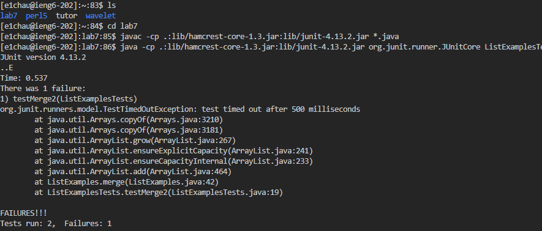

# Lab Report 4

## Logging in, Cloning

Keys Pressed: `ssh e1chau@ieng6.ucsd.edu`, `<enter>`, `<my password>`, `<enter>`, `git clone https://github.com/noside085/lab7`, `<enter>`
Summary: The `ssh e1chau@ieng6.ucsd.edu` command and entering my password allowed me to log into my `ieng6` account. Then the `git clone https://github.com/noside085/lab7` allowed me to clone my repository for lab7 from my github account to the server.

## Running (Failed) Test

Keys Pressed: `ls`, `<enter>`, `cd lab7`, `<enter>`, `javac -cp .:lib/hamcrest-core-1.3.jar:lib/junit-4.13.2.jar *.java`, `<enter>`, `java -cp .:lib/hamcrest-core-1.3.jar:lib/junit-4.13.2.jar org.junit.runner.JUnitCore ListExamplesTests`, `<enter>`
Summary: The command `ls` allowed me to view the content in my current directory, then `cd lab7` changed the directory to `lab7`. Afterwards, I used the commands `javac -cp .:lib/hamcrest-core-1.3.jar:lib/junit-4.13.2.jar *.java` and `java -cp .:lib/hamcrest-core-1.3.jar:lib/junit-4.13.2.jar org.junit.runner.JUnitCore ListExamplesTests` to run and compile the tests, resulting in the failed test results.

##
